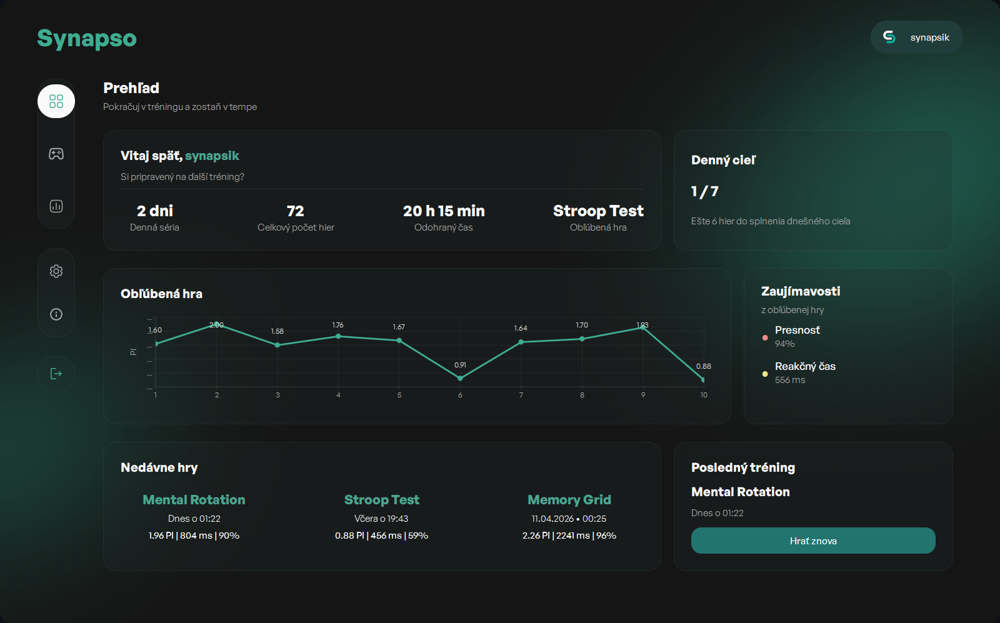
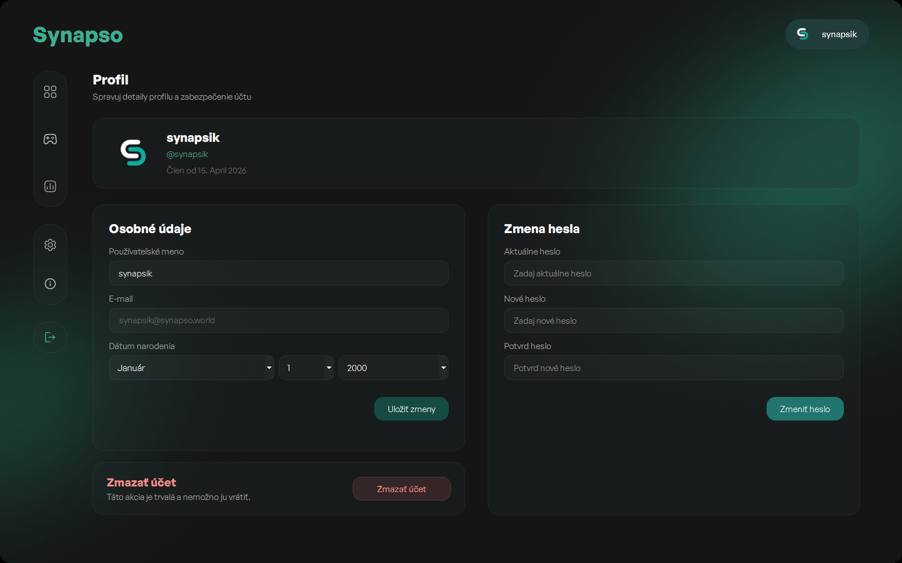
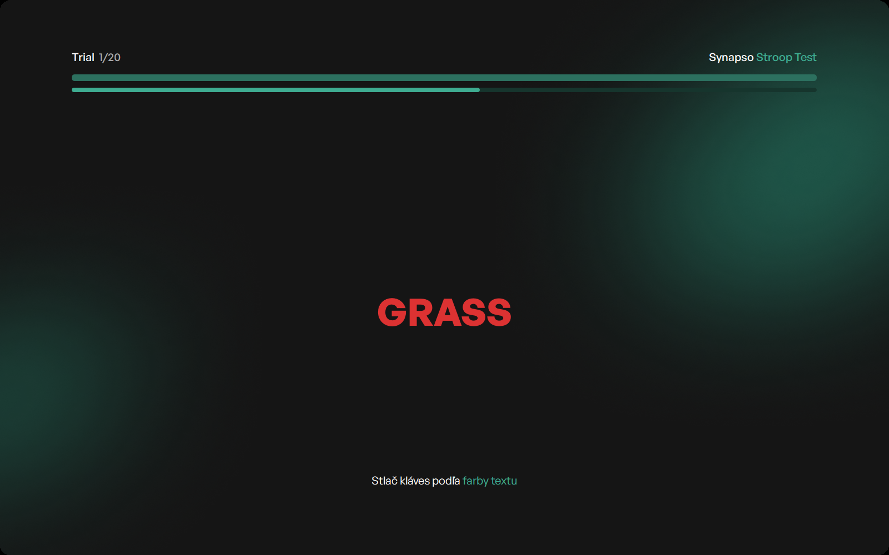
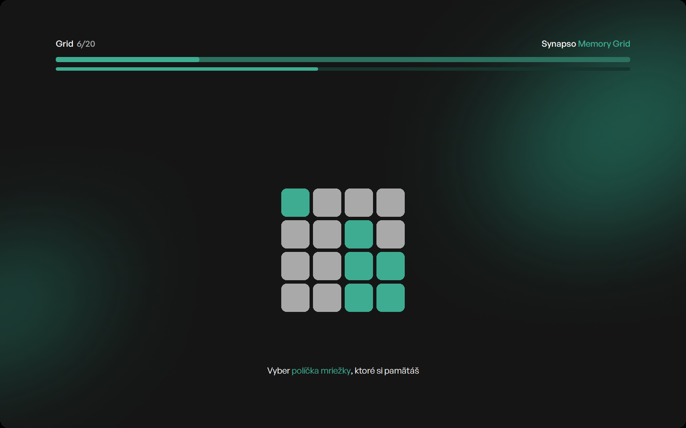
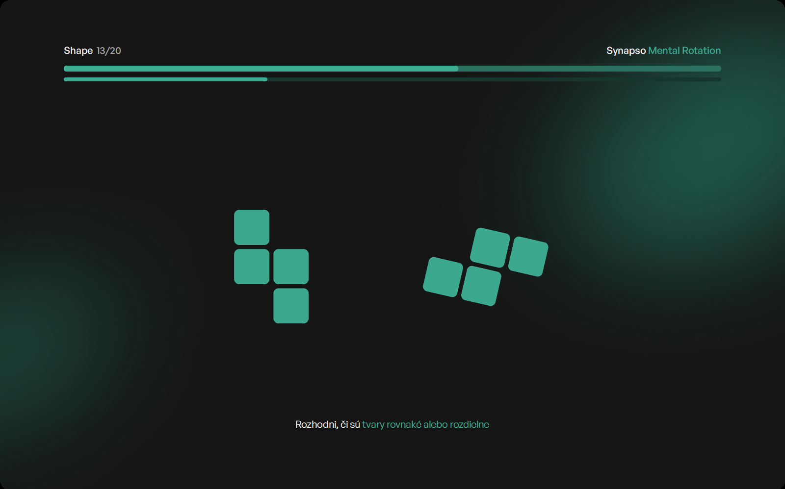

  <h1>Synapso</h1>
  <h3>Cognitive Training & Brain Performance Platform</h3>
  
  
<strong>Desktop application for brain training — reaction time, memory, and spatial reasoning.</strong>

  
  
  
  

---

## ✨ What is Synapso?

**Synapso** is a modern desktop application designed to train and improve cognitive abilities through engaging, scientifically inspired mini-games.

It helps you enhance **attention**, **working memory**, and **spatial reasoning** while tracking your progress with detailed analytics and global leaderboards.

---

### Screenshots

#### Dashboard

#### Profile

#### Stroop Test

#### Memory Grid

#### Mental Rotation

---

## 🔥 Key Features

- **Stroop Test** – attention and cognitive control
- **Memory Grid** – visual working memory
- **Mental Rotation** – spatial reasoning
- Precise reaction time & accuracy tracking
- Adaptive difficulty based on your performance
- Global leaderboards
- Detailed personal statistics and progress tracking
- User profiles with avatars
- Dark / Light theme support
- English & Slovak languages

---

## 🚀 How to Run

1. Go to the **[Releases page](https://github.com/wrex1k/Synapso/releases)**
2. Download the latest `Synapso.zip`
3. Extract the zip if needed
4. Double-click `Synapso.exe` to start

> **Note:** On first run, Windows SmartScreen may show a warning. Click **"More info" → "Run anyway"**.

**Supported:** Windows 10 / 11 (64-bit)

---

## 🎮 How to Play

- Sign up or log in
- Complete the short tutorial for each game
- Play and improve your scores
- Compare yourself on the global leaderboard

All your progress is saved automatically in the cloud.

---

## 🛠 For Developers

**Tech Stack:**

- Python 3.12 + PySide6 (Qt)
- Supabase (PostgreSQL, Auth, Realtime)
- Packaged as a single executable with PyInstaller

---

## 🤝 Contributing

Contributions and feedback are welcome!

 

  
<b>Made with ❤️ to make brains sharper</b>

